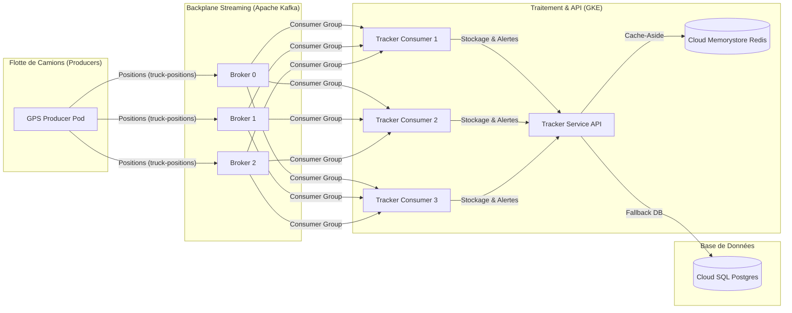
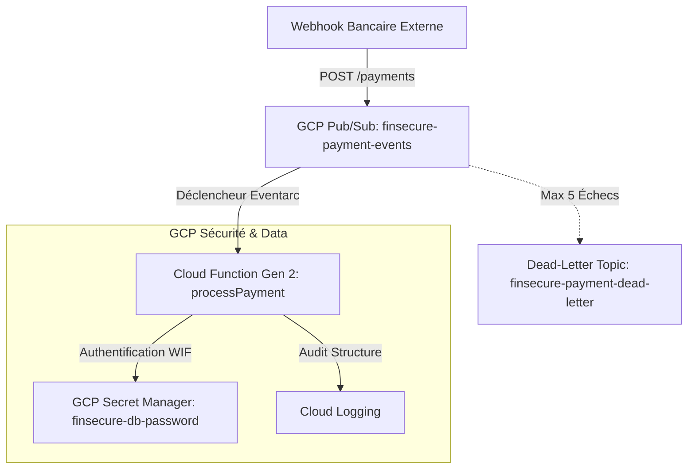

# LogiStream — Système de Suivi GPS & Plateforme de Paiement FinSecure

LogiStream est une plateforme cloud-native haute performance conçue pour suivre une flotte de camions en temps réel et gérer l'infrastructure de traitement des paiements de FinSecure de manière hautement sécurisée (DevSecOps), serverless et performante.

L'architecture s'étend sur deux volets principaux :
1. **LogiStream (Ingestion de Flux Réseau GKE & Kafka)** : Suivi GPS en temps réel.
2. **FinSecure (Serverless Event-Driven)** : Traitement asynchrone des transactions financières.

---

## 🏗️ Architecture du Système Complet

### 1. Ingestion de Positions GPS (Microservices GKE & Apache Kafka)



### 2. Plateforme de Traitement des Paiements FinSecure (Event-Driven Serverless)



---

## 🚀 Fonctionnalités & Technologies Clés

### 🛡️ DevSecOps & Sécurité Avancée
*   **GitHub OIDC Workload Identity Federation (WIF)** : Plus aucune clé JSON d'accès GCP stockée dans GitHub Actions. Authentification sécurisée par signature de jeton à la volée.
*   **Shift-Left Trivy Scan** : Scan de vulnérabilités intégré dans le workflow de CI/CD bloquant automatiquement le déploiement en cas de failles critiques (`HIGH`, `CRITICAL`).
*   **GKE Workload Identity** : Association sécurisée entre le Service Account Kubernetes (`finsecure-app-ksa`) et l'IAM GCP sans générer de clés statiques.
*   **Secret Manager** : Stockage centralisé et chiffré des secrets avec accès RAM éphémère (`emptyDir` en Memory sur GKE) ou via SDK Secret Manager dans les Cloud Functions.

### ⚡ Architecture Event-Driven & Serverless
*   **Cloud Functions (Gen 2)** : Traitement à la volée des événements de paiement via des conteneurs éphémères Cloud Run scalant à 0.
*   **Pub/Sub & Dead-Letter Channel** : Ingestion asynchrone résiliente avec redirection des messages corrompus (Poison Messages) vers une file d'erreur après 5 tentatives infructueuses.
*   **Cloud Scheduler** : Planification serverless de tâches de réconciliation quotidiennes (cron `0 23 * * *`) et de purges hebdomadaires.

### 📈 FinOps & Performance (Cache-Aside Redis)
*   **Gouvernance Financière** : Labels standardisés appliqués sur toutes les ressources (`team`, `environment`, `feature`, `cost-center`) et budget de production (1500€/mois) configuré avec 3 seuils d'alertes (50%, 90%, 100%).
*   **Committed Use Discounts (CUD)** : Analyse de rentabilité d'engagement sur 1 an ou 3 ans pour GKE et Cloud SQL.
*   **Cloud Memorystore Redis** : Cache-Aside pattern réduisant le temps de latence de lecture SQL de 202ms à 2.1ms (gain de performance de **x96**).

---

## 🛠️ Commandes de Vérification Rapides

### 📈 Logs du Tracker GPS
```bash
kubectl logs -l app=tracker-consumer -n logistream --tail=20
```

### 💬 Déclenchement de la Cloud Function de Paiement
```bash
gcloud pubsub topics publish finsecure-payment-events \
  --message='{\"transaction_id\":\"TXN-2026-004\",\"amount\":299.99,\"currency\":\"EUR\",\"status\":\"VALIDATED\",\"merchant_id\":\"MERCH-456\"}'
```

### 📊 Lecture des logs de la Cloud Function
```bash
gcloud logging read "resource.type=cloud_run_revision AND resource.labels.service_name=finsecure-payment-processor" --limit=10 --format="table(timestamp,textPayload)"
```
