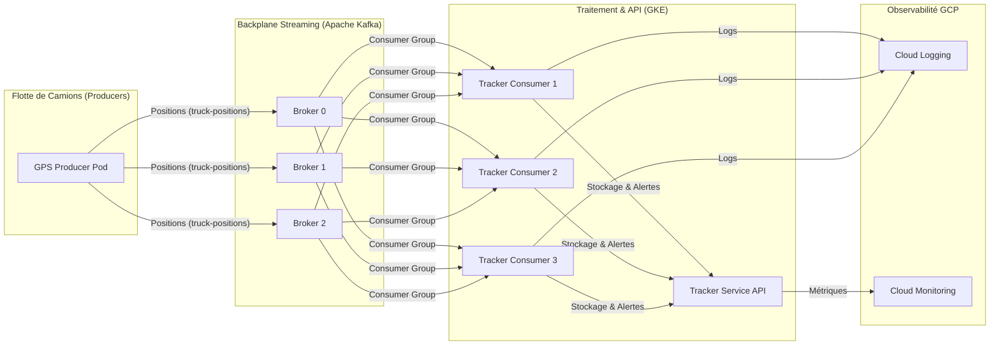

# LogiStream — Système de Suivi GPS en Temps Réel

LogiStream est une plateforme de streaming haute performance conçue pour suivre une flotte de camions en temps réel. Elle utilise une architecture microservices déployée sur **Google Kubernetes Engine (GKE)** et s'appuie sur **Apache Kafka** pour garantir une ingestion de données fluide et résiliente.

## 🏗️ Architecture du Système



## 🚀 Technologies utilisées

*   **Cloud** : Google Cloud Platform (GKE Autopilot)
*   **Streaming** : Apache Kafka (via l'opérateur Strimzi)
*   **Langage** : Node.js (KafkaJS)
*   **CI/CD** : GitHub Actions (Build, Push & Deploy via Workload Identity Federation)
*   **Observabilité** : Cloud Monitoring & Cloud Logging

## 🛠️ Vérification du fonctionnement

### Logs du Consumer (Réception temps réel)
```bash
kubectl logs -l app=tracker-consumer -n logistream --tail=20
```

### État du Consumer Lag (Retard Kafka)
```bash
kubectl run kafka-check-lag --image=quay.io/strimzi/kafka:0.51.0-kafka-4.1.1 --restart=Never -n logistream --rm -i -- /bin/bash -c "bin/kafka-consumer-groups.sh --bootstrap-server logistream-kafka-kafka-bootstrap:9092 --describe --group tracker-service-group"
```

## 📈 Évolutivité (Scaling)
Le système est configuré avec un **Horizontal Pod Autoscaler (HPA)** qui ajuste automatiquement le nombre de réplicas du service de tracking en fonction de l'utilisation du CPU (seuil à 60%).
